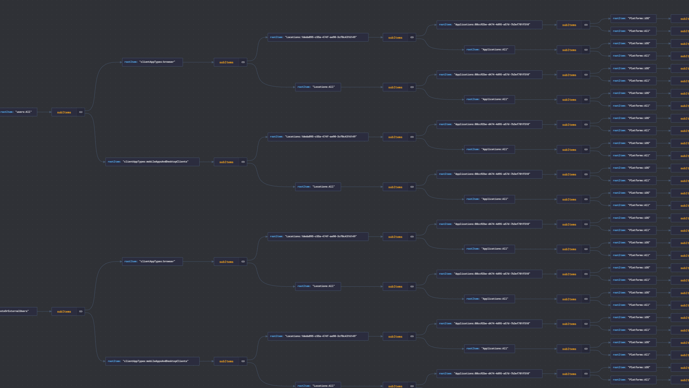
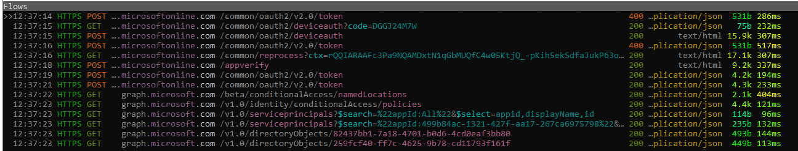

- [CA Optics - Azure AD Conditional Access Gap Analyzer](#ca-optics---azure-ad-conditional-access-gap-analyzer)
  - [What is Conditional Access?](#what-is-conditional-access)
  - [Notes for early testers](#notes-for-early-testers)
- [Release notes](#release-notes)
- [Documentation](#documentation)
  - [Example of a gap](#example-of-a-gap)
  - [Permutation generation](#permutation-generation)
  - [Prerequisites](#prerequisites)
  - [Important](#important)
  - [Description - Conditional Access Gap analyzer](#description---conditional-access-gap-analyzer)
    - [Compared to existing tooling](#compared-to-existing-tooling)
  - [Scope](#scope)
  - [Opinionated design](#opinionated-design)
    - [Design decisions](#design-decisions)
      - [Platform lookup](#platform-lookup)
      - [Lookup differences](#lookup-differences)
      - [Group nesting](#group-nesting)
  - [Parameters](#parameters)
  - [Running the tool](#running-the-tool)
  - [Viewing reports](#viewing-reports)
  - [Troubleshooting](#troubleshooting)
- [Contributing](#contributing)

---


# CA Optics - Azure AD Conditional Access Gap Analyzer

Azure AD Conditional Access Gap Analyzer is a solution for scanning gaps that might exist within complex Azure Active Directory Conditional Access Policy setups.


## What is Conditional Access?

If you are new to Conditional Access we recommend that you review the following Microsoft article: https://docs.microsoft.com/en-us/azure/active-directory/conditional-access/overview

---

## Notes for early testers

After completing the pre-requisites and reading this readme file, consider following:

>⚠ Policies that are only available from /beta/ endpoint are automatically excluded from scope. This includes any new policy with guest settings at the time of writing


1. reportOnly policies are not considered terminating:
 Read: [``scope``](#scope)

2. run each scan with [``--clearPolicyCache``](#parameters)
3. run each scan with [``--clearMappingCache``](#parameters) if you do changes in the groups / users related to policies

4. only policies targeting users and apps are in scope (this is the most common scope, but means for example, that security registration policy is not evaluated)
 Read: [``scope``](#scope)

4. Start with test environment so you get some experience and can set expectations about the tool mechanics
5. if you have known group or users that are excluded from policies define with ``--skipObjectIds`` objects to be excluded from the scan unless you are looking to confirm the exclusions
6. If you are running scans in multiple environments ensure: logins and caches are removed before running new scans
  
   Read:[parameters](#parameters)
    - if you have AZ CLI installed, then clear AZ CLI cache before proceeding with ``az account clear`` and new perform new login to the environment you are planning to scan with ``az login`` 

Read [other important notes](#important)

---

# Release notes

    Release notes: 0.6.5 beta
    - Added counter to reporting when high number of permutations is also added to report (default is to add only unterminated)
    - Minor code fixes changing <var> to <let> 
    - Report filename now includes day, month, year and tenantId e.g. report_day_4_month_9_year_2022-tenant_48f55450-183a-45d6-a9ce-68f3cbc68947.csv

    Release notes: 0.6.4 beta
    - Get more groups per single call (less batching)
    - Fix race condition detected when generally using for await loops 
    - Enclose values with "" between delimitters (CSV)

    Release notes: 0.6.3 beta
    - Optimizations to way the mapped objects are handled. 
      - Mapped objects are cached. You can recreate the object mapping by using parama 'clearMappingCache'
      - Lookup keys will start from 'user/group/role' conditions always first
      - Added possibility to populate usermap with random UUID's to test for performance impact (this just debug option, and not really something that would be in non-beta versions)
    
    Release notes: 0.6.2 beta
    - Separated cache params into separate functions -> (clearTokenCache and ClearPolicyCache)
    - Added possibility of running pre-optimized algorithm on permutations with param --aggressive (High memory consumption, only here for A/B testing)
    - merge completed.
  
    Release notes: 0.6.1 beta 
    - Basic version of CSV reporting added
    - Streamlined permutation generation to ensure essential permutations are generated, and some permutations are are terminated earlier on the lookups

    Release notes: 0.6 beta (first non "silent" release)
    - App displayNames added to MD report. Object type added to the user type

    Release notes: 0.5.2,0.5.1,0.5 beta  (see previous branches for release notes)
    
---


---
# Documentation 
## Example of a gap

  

**Example of cross-policy detection**

❌ Any permutation with value 0 means that no policies was terminated for that particular combination of conditions.

Policy | Terminations | lookup 
 -|-|- 
All|  0| Applications:88cc92be-d474-4d95-a57d-7b3ef701f510 -> Locations:finland -> users:GuestsOrExternalUsers 
All|  0| Applications:88cc92be-d474-4d95-a57d-7b3ef701f510 -> Locations:finland -> users:Jane Doe  
All|  0| Applications:88cc92be-d474-4d95-a57d-7b3ef701f510 -> Locations:finland -> users:John Doe 


✅ Read detailed description of detection in [``docs/example.md``](/docs/example.md)


---

## Permutation generation

Permutation are generated by [``getPol2.js``](ca/mainPlugins/getPol2.js) 
- How it works? Recursive search is performed for all conditions and then conditions are placed under unique permutations


[Permutations can be visualized with JSON Crack service:](https://jsoncrack.com/editor?json=%5B%5B%22rootItem%22%2C%22subItems%22%2C%22a%7C0%7C1%22%2C%22users%3AGuestsOrExternalUsers%22%2C%22clientAppTypes%3Abrowser%22%2C%22Locations%3A1deda895-c55a-474f-ae90-3cf0c4316149%22%2C%22Applications%3A88cc92be-d474-4d95-a57d-7b3ef701f510%22%2C%22Platforms%3AiOS%22%2C%22a%7C%22%2C%22o%7C2%7C7%7C8%22%2C%22Platforms%3AAll%22%2C%22o%7C2%7CA%7C8%22%2C%22a%7C9%7CB%22%2C%22o%7C2%7C6%7CC%22%2C%22Applications%3AAll%22%2C%22o%7C2%7CE%7CC%22%2C%22a%7CD%7CF%22%2C%22o%7C2%7C5%7CG%22%2C%22Locations%3AAll%22%2C%22o%7C2%7CI%7CG%22%2C%22a%7CH%7CJ%22%2C%22o%7C2%7C4%7CK%22%2C%22clientAppTypes%3AmobileAppsAndDesktopClients%22%2C%22o%7C2%7CM%7CK%22%2C%22a%7CL%7CN%22%2C%22o%7C2%7C3%7CO%22%2C%22users%3AAll%22%2C%22o%7C2%7CQ%7CO%22%2C%22a%7CP%7CR%22%5D%2C%22S%22%5D)

 >(Visualization by https://jsoncrack.com/)


>  


## Prerequisites

**Runtime**
- Node.JS 14 LTS (Linux) ([Install in Linux](https://github.com/nvm-sh/nvm#install--update-script))
- Node.JS 16 LTS (Windows) ([Install in Windows](https://docs.microsoft.com/en-us/windows/dev-environment/javascript/nodejs-on-windows#install-nvm-windows-nodejs-and-npm))

**If you prefer not to use the fire & forget version**
```bash
nvm use 16
git clone https://github.com/jsa2/caOptics;
cd caOptics;
npm install;
```

**Fire and forget run setup for Azure Cloud Shell (Bash)**

```bash
curl -o- https://raw.githubusercontent.com/jsa2/caOptics/public/init.sh | bash;
# Force reload of NVM
export NVM_DIR="$([ -z "${XDG_CONFIG_HOME-}" ] && printf %s "${HOME}/.nvm" || printf %s "${XDG_CONFIG_HOME}/nvm")"
[ -s "$NVM_DIR/nvm.sh" ] && \. "$NVM_DIR/nvm.sh" 
# This loads nvm
```

```bash
cd caOptics
# Force fresh login (AZ CLI can't use the built-in token for the scope we are looking in here)
az login
``` 

**Azure AD Related**
- Azure AD Security Reader role enabled 
- If have Azure CLI and existing CLI session, this tool will use that [session](tokenHandler/getCode.js). 
   - If you don't have Azure CLI installed just Azure CLI clientID is used to get tokens with device_code flow initated by the Node.js http client

      >  


**Following open source packages are used**

To reduce amount of code, we use the following depedencies for operation and aesthetics are used (Kudos to the maintainers of these fantastic packages. Each packages license link is supplied in the license column)
  
 package | aesthetics|operation|license
  -|-|-|-
  [axios](https://www.npmjs.com/package/axios)||✅ | [MIT](https://github.com/axios/axios/blob/v1.x/LICENSE)
  [yargs](https://www.npmjs.com/package/yargs)||✅ | [MIT](https://github.com/yargs/yargs/blob/main/LICENSE)
  [jsonwebtoken](https://www.npmjs.com/package/jsonwebtoken) | |✅|[MIT](https://github.com/auth0/node-jsonwebtoken/blob/master/LICENSE)
  [chalk](https://www.npmjs.com/package/chalk)| ✅ | |[MIT](https://github.com/chalk/chalk/blob/main/license)
   [js-beautify ](https://www.npmjs.com/package/js-beautify) | ✅ | |[MIT](https://github.com/beautify-web/js-beautify/blob/main/LICENSE)

**What network access is needed for this to work?**

1. Following hosts are needed for operation

  ```sh
  graph.microsoft.com
  login.microsoftonline.com
  ```

2. Before operation access to github and npmjs is needed to download depedencies. 
   > If you plan to run this tool in network restricted environment, then download the depedencies first in an environment that allows access to package installations and github.com. You may then transfer the whole installation directory zipped to the network restricted environment

 > Below is typical trace I do when I am running any 3rd party packages on my Node.js apps. It shows the URL's that are being called in runtime 

    

 ---

## Important

1. Read the [License](LICENSE)

2. ⚠️ No Input sanitization is performed on launch params, as it is always assumed, that the input of these parameters are controlled, and this tool does not run in uncontrolled environment (or unattended).  While I have not reviewed all paths, I believe that achieving shellcode execution is trivial. This tool does not assume hostile input, thus the recommendation is that you don't paste launch arguments into command line without reviewing them first.
3. We recommend that this tool is always run only by **read-only permissions** (if you have AZ CLI installed, remove AZ CLI cache before proceeding ``az account clear``)
4. Legacy auth is not evaluated when the evaluated policy includes **only** legacy auth conditions - **Backround**: Microsoft is in the process of deprecating basic auth for Exchange, so large part of the legacy auth evaluation will soon (end of 2022) become irrelevant. 
   >You can still opt for ``--includeLegacyAuth`` parameter to include only legay auth policies in the mix. Bare in mind, that this will assume, then that Legacy Auth is covered for all apps (thus evaluate it also for apps not supporting legacy auth), not only EXO
5. Tooling stores AZ CLI refresh token locally to retain session persistence - Tokens are cached locally in plaintext (just like they are cached with Azure CLI in BASH, regardless you use this tool or not). While token cache can be encrypted, it does not offer any benefits for the PoC for this time. Encrypting the token cache would not help that much either, as possibly many other tools/apps running in the system store opaque refresh tokens in their plaintext format. 
6. Regarding the reporting and permutations: I am still working figuring out the best balance between readability and verbosity. I do believe that all gaps in scope are catched, but I've done numerous changes to algorithm of such detections, and thus there could still be some edge conditions I have not considered. 

 
---


## Description - Conditional Access Gap analyzer 

This tool solves the problem of finding gaps in Conditional Access Policies, even when the gap would not appear in sign-in logs.

### Compared to existing tooling

How is this tool different from the existing tools?

Tool | BPA ¹ | Gap analytics | Additional requirements
-|-|-|-
[``Microsoft Azure AD Assessment``](https://github.com/AzureAD/AzureADAssessment/) | ✅ |  - Only in relation to BPA | new app registration
[``Conditional access gap analyzer workbook`` ](https://docs.microsoft.com/en-us/azure/active-directory/reports-monitoring/workbook-conditional-access-gap-analyzer)| - | ² Only when the gap can attributed to sign-in event | logs are exported to Log Analytics workspace
[``CA Optics``]() | - | ✅ |³ Access to Azure Cloud Shell and permissions to read CA policies via MS Graph API 


**additional**

>¹ Best Practices analyzer
 
>² Gap can't be identified if conditions that expose the gap have never recorded to sign-in log

>³ Cloud Shell is not strict requirement, but good alternative for users of this tool, that might not have Node.js installed 


## Scope
At version 0.5 the conditions that are covered are as follows:

 ✅``Users / Roles /Groups`` 

 ✅``Cloud apps`` (only policies that define all apps, or single apps are in scope)

 ✅``Device platforms`` (e.g. user-agents)

 ✅``Locations``  

 ✅``Client Apps`` (e.g. browser / desktop & mobile apps) ¹

 ✅``Access Controls (Grant / Block)`` (Only policies that have Access Controls enabled are in scope ²)

 - These conditions were chosen as starting point, as most of the typical attacker abusable gaps occur in these policies. As we gain more experiences from testing of this tool we will introduce new gap detections. 
  - >(Anything that is not on the list, is not evaluated. eg. risk based policies are not considered covering gaps, as the risk detection is not considered perfect, and should be used rather in situations you want to block something vs. require MFA only when there is risk associated)


>¹ Given that Microsoft is deprecating Legacy Auth, legacy auth is not reviewed
>² Policy enforcement needs to be enabled (report only policies are not evaluated by default, but can included with certain flag)


## Opinionated design

It is important to understand that the tool reflects its creators opinions in policy design:

There are two schools of Conditional Access design
1. > Include based: Only apply CA to conditions that match the predicted use of organization use patterns.
2. > Exclude based: Apply CA in all conditions, and then create narrow exclusions to handle these exceptions. 

⚠ This tool only works for the latter school of CA design. The basis of this design is, that attacker considers all access patterns valid, even ones that organization might not consider valid for their own use.  If your usage patterns does not fit the approach taken by this tool, we recommend that you consider instead the use of [existing tooling](#compared-to-existing-tooling)

---

This school of thought is similar to Microsoft Best Practice ['Apply Conditional Access policies to every app'](https://docs.microsoft.com/en-us/azure/active-directory/conditional-access/plan-conditional-access#apply-conditional-access-policies-to-every-app
) with the distinction to the following statement, that besides apps all, also all other configured conditions should be covered by a policy, or certain type exclusion ¹

>*Ensure that every app has at least one Conditional Access policy applied. From a security perspective it's better to create a policy that encompasses All cloud apps, and then exclude applications that you don't want the policy to apply to. This ensures you don't need to update Conditional Access policies every time you onboard a new application.*


>>¹ This tool considers gap to be covered also when trusted location, or trusted device exclusion is used, and policy is not thus applied due to use of trusted device or location. It is worth saying, that there are admin use best practices, that should require the trusted location or trusted device to be combined with MFA. 

---

### Design decisions

---
#### Platform lookup

Current Design requires that all conditions are matched with 'All' platforms policy. This is based on the scenario, where all clients are selected explicitly, and thus no "unknown" clients are selected in this particular policy

**Example of such condition**
```json
 "platforms": {
            "includePlatforms": ["all"],
            "excludePlatforms": ["macOS"]
        },
```

**reference** https://learn.microsoft.com/en-us/azure/active-directory/conditional-access/concept-conditional-access-conditions#device-platforms


> **Important** <br> *Microsoft recommends that you have a Conditional Access policy for unsupported device platforms. As an example, if you want to block access to your corporate resources from Chrome OS or any other unsupported clients, you should configure a policy with a Device platforms condition that includes any device and excludes supported device platforms and Grant control set to Block access.* 

---

#### Lookup differences


1. Role lookup
> When roles are used as conditions lookup for exclusions/inclusions is dictated only by the role. This might result in situation, where the policy terminates correctly to a role, but user who is in that role might be still excluded from the policy in the results. In the results both conditions are highlighted (not merged). This is purely design decision, as we want to show role terminations seperately without user or group context. 

 --- 

    Example:
    userID:0cd1b62d-5ff8-497b-9b56-9bb02bc0ab8c is included from All Apps policy

    There is admin policy, that covers role of Global administrator, but not the userId. 

    Both of following conditions would be shown in results:
    1. Role GA is excluded individually (1)
    2. UserId is not explicitly targeted by group or userId (0)

    All (cross-policy)	policies matched:1	users:Company Administrator
    All (cross-policy)	policies matched:0	users:joosua santasalo
    


---

2. Group lookup
> Conversely if groups are used, the policy termination is merged, and so user exclusion would be shown as terminated by the group inclusion.

    Example:
    userID:194383eb-6053-4d1e-bc72-f332be6ca2cb is included from All Apps policy

    There is policy which targets the user only by group

    Following conditions would be shown in results:
    1. User is excluded individually 
    2. User is targeted via group.

  
    All (cross-policy)	policies matched:1	users:Vihtori Santasalo (matched via group)


3. Guest lookup
   
Users are not mapped as guests at this release. This feature will be introduced later enabling catching inclusions/exclusions of guest userId's to correctly mapped to ``GuestsOrExternalUsers`` property.
Currently guest users are mapped just like normal users.

#### Group nesting

  >Due to performance considerations nesting depth for resolving membership of groups is only resolved once if group is group of another group. Otherwise there is risk of resolving memberships indefinitely, as subgroup might include any of the root groups, resulting in un-ending loop condition

    Membership:    
    Group1 -> all members resolved
    --> user is member of Group1
    --> Group2 is member of Group1 -> all members resolved to Group1
      --> Group3 is member of Group1 -> NOT RESOLVED

> If you dare... you can increase the nesting directly in the code... [group.js](ca/mainPlugins/userMappers/group.js)

  


## Parameters

Param| Description 
-|-
``mapping`` | By default user and group based exclusions are evaluated by objects exact ID. For example if object is excluded by one policy, the object should be found in another policy by it's exact id. <br> Using `` --mapping`` invokes MS Graph to populate relationship between objects in a way that ensures, that for example user can be excluded by userId in one policy, while the evaluation detects that user is included in another policy by a groupId. <br> e.g. ``--mapping`` 
``clearMappingCache`` | Clears user / group mappings retrieved on earlier run <br> e.g ``--clearMappingCache`` 
``skipObjectId `` | Removes ObjectId from permutations. This migth be useful, if you want to exclude break-glass account from results <br> e.g. ``--skipObjectId=bcd27e9b-8974-42ec-a2a1-ba2498b45674,c7a4a639-00e7-47e0-aa9d-ea502bbbd382`` 
``skip `` | Removes full permutation category. <br> e.g. ``--skip=users`` 
``includeReportOnly `` | Allows mixing reportOnly policies with enabled policies. Remove existing policies before running this by removing the policies.json file in the root, or use ``clearPolicyCache`` option <br> e.g. ``--includeReportOnly`` 
``includeLegacyAuth `` | By default policies that have just legacy auth conditions are not evaluated. Use this flag if you want to include legacy auth into the analysis <br> please note that including legacy auth will review it against all apps, not only supported workloads (AAD,SPO,EXO) <br> e.g. ``--includeLegacyAuth`` 
``clearPolicyCache `` | Removes policy caches <br> e.g. ``--clearPolicyCache`` 
``clearTokenCache `` | Removes token caches <br> e.g. ``--clearTokenCache`` 
``allTerminations`` | Includes also results that terminated to policy <br> ``--allTerminations``
``debug`` | Shows memory use and estimation of progress <br> eg. ``--debug``

## Running the tool

>Before running the tool first time 

```sh 
#Navigate to the cloned folder
cd caOptics;
#Install depedencies
npm install
```

Each run will initiate login if no session is stored. If you have session on Azure CLI and would like to use another session, then in Azure CLI run ``Az Account Clear`` 

1. Static run (no [mapping](#parameters) )
>``node ./ca/main.js `` 
2. Static run (with [mapping](#parameters) )
>``node ./ca/main.js --mapping`` 
3. Supplying ``skipObjectId=yourID`` to exclude Break glass group 
>``node ./ca/main.js --mapping  --skipObjectId=259fcf40-ff7c-4625-9b78-cd11793f161f`` 

Also, if you are experimenting with the tool, it is recommended to include ``--clearPolicyCache --clearTokencache``  param. This will remove existing session tokens, and the policy.json (cache)

>remove policies.json from the project folder, if you don't want to remove session from cache, but just want to have policies to be removed

**Expected output (based on example data)**

Policy | Permutation | Terminations | lookup 
 -|-|-|- 
All (cross-policy)| 33a51ecbcc58466a90b6bea66b239c74|  0| Locations:10a25087-9bf6-479b-a2a1-37e814310c90 -> Platforms:macOS -> clientAppTypes:mobileAppsAndDesktopClients -> users:All 
All (cross-policy)| 4194a5e64e054764bd8774d4992887b9|  0| Locations:10a25087-9bf6-479b-a2a1-37e814310c90 -> Platforms:macOS -> clientAppTypes:mobileAppsAndDesktopClients 
All (cross-policy)| 24f38821ea8e4331aeae7c078a727236|  1| Locations:10a25087-9bf6-479b-a2a1-37e814310c90 -> Platforms:macOS 


## Viewing reports
All successful runs output ``crosstable.md`` (a markdown table) and csv ``report.csv`` 
- Each new run of the tool will erase the previous report

**Example of .csv report**

```
users                 Applications clientAppTypes              Platforms locations terminations  
-----                 ------------ --------------              --------- --------- ----------
GuestsOrExternalUsers All          browser                     macOS     finland   0
user-Joosua Santasalo All          browser                     macOS     finland   0
user-Joosua Santasalo All          mobileAppsAndDesktopClients macOS     finland   0
All                   All          browser                     macOS     finland   0
```

**Example of .json dump**

```json
[
    {
        "policy": "all",
        "lineage": "Platforms:macOS -> clientAppTypes:browser -> users:All -> Locations:10a25087-9bf6-479b-a2a1-37e814310c90 -> ",
        "lookup": "Locations:10a25087-9bf6-479b-a2a1-37e814310c90",
        "terminated": []
    },
    {
        "policy": "all",
        "lineage": "Platforms:macOS -> clientAppTypes:browser -> users:GuestsOrExternalUsers -> Locations:10a25087-9bf6-479b-a2a1-37e814310c90 -> ",
        "lookup": "Locations:10a25087-9bf6-479b-a2a1-37e814310c90",
        "terminated": []
    }
]
```


## Troubleshooting

- If you are using AZ CLI for session login, start with ``az account clear`` 
- Upon running the tool add the ``--clearPolicyCache --clearTokencache`` to clear caches (tokens, policies and locations)
- remove existing policies.json and namedLocations.json from project root manually (if you are not using the ``--clearPolicyCache --clearTokencache``  option )
- If Group includes don't seem to work, ensure ``--mapping`` is selected, and you don't have nesting beyond two groups

--- 

**Testing in Azure Cloud Shell**

If you are testing this solution in larger environment. Enable ``--debug`` in parameters and if possible increase the node heap size `` --max-old-space-size=4096 `` 
  - Testing experience has shown, that the amount of permutations can reach quite high numbers with large environments. running with debug mode can help pointing out where the issue might occur. In such scenarios using Cloud Shell might not be viable (though the permuation algorithm has now hugely reduced memory use, but I have not been able to confirm, that cloud shell would work in large environments)

> Since the current algorithm for permutation generation is much reduced from original one, even Cloud Shell should work, but for example race condition, or other memory leak might still loom somewhere, and manifest in larger environments, mitigating the benefits of the current algorithm. 

``node --max-old-space-size=4096 ./ca/main.js --mapping  --skipObjectId=259fcf40-ff7c-4625-9b78-cd11793f161f --clearPolicyCache --debug`` 


---

- You might have empty references in CA policies and lookup will thus show unterminated condition

  >  


# Contributing

Open a pull request, or submit a issue depending on the scope of the request. 
